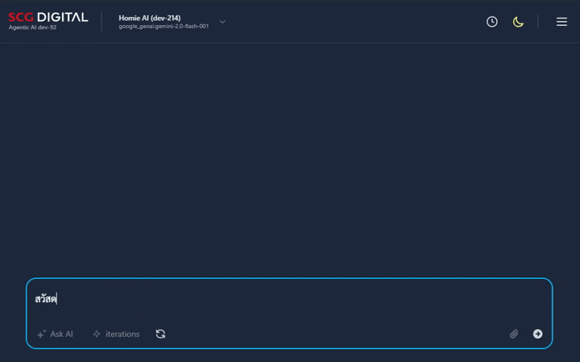
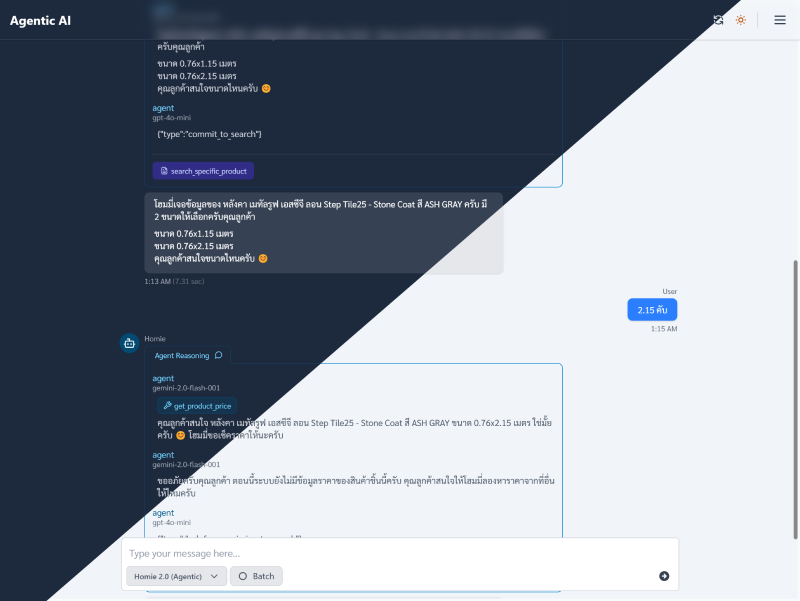

# 🤖 Agentic Chat UI

<div align="center">



**เครื่องมือสนทนากับ AI Agent ที่ทันสมัยและน่าใช้งาน** ✨

[](https://astro.build)
[](https://svelte.dev)
[](https://tailwindcss.com)
[](https://bun.sh)

</div>

---

## 🌟 ทำไมต้องเลือก Agentic Chat UI?

**Agentic Chat UI** คือ interface การสนทนาแห่งอนาคต ที่ออกแบบมาเพื่อการทำงานร่วมกับ AI Agent แบบเฉพาะทาง โดยใช้เทคโนโลยีเว็บล้ำสมัย มอบประสบการณ์การสนทนาที่ลื่นไหล ตอบสนองเร็ว และโต้ตอบได้อย่างมีประสิทธิภาพ

<div align="center">

</div>

## 🌟 Key Features

### 💬 **Intelligent Chat Experience**

- **Real-time messaging** with AI agents
- **Tool execution visualization** - See how AI agents use tools in real-time
- **Structured agent reasoning** display
- **Markdown rendering** for rich text formatting
- **Image and sticker support** for expressive conversations

### 🎨 **Beautiful & Responsive UI**

- **Dark/Light theme** with smooth transitions
- **Mobile-first responsive design**
- **Animated interactions** and micro-animations
- **Clean, modern interface** built with TailwindCSS
- **Accessibility-focused** design patterns

### ⚡ **Developer Experience**

- **Hot reload** development with Astro + Svelte
- **TypeScript support** for type safety
- **Component-based architecture** for maintainability
- **Docker containerization** for easy deployment
- **CI/CD ready** with GitHub Actions

### 🔧 **Advanced Functionality**

- **Multiple AI model support** with dynamic switching
- **Session management** and chat history
- **Batch mode** for efficient multi-message interactions
- **Debug tools** for development and troubleshooting
- **Comprehensive keyboard shortcuts** for power users
- **Tool data inspection** with JSON viewer and clipboard support

### ⌨️ **Keyboard Shortcuts**

| Shortcut                     | Action                   |
| ---------------------------- | ------------------------ |
| `Ctrl + Space` / `⌘ + Space` | Toggle batch mode        |
| `↑` / `↓`                    | Navigate message history |
| `Enter`                      | Send message             |
| `Ctrl + Enter` / `⌘ + Enter` | Insert new line          |
| `Ctrl + R` / `⌘ + R`         | Reset session            |
| `Esc`                        | Close modals             |

## 🚀 Quick Start

### AD/Entra Login Gate

เมื่อ deploy ผ่าน `docker-compose.yaml` ของ repo หลัก หน้า chat จะถูกบังคับ login ด้วย AD/Entra เป็นค่าเริ่มต้น
ให้ register redirect URI ใน Entra ID แล้วตั้งค่า:

```env
AUTH_ENABLED=true
AUTH_TENANT_ID=<tenant-id>
AUTH_CLIENT_ID=<ui-or-api-client-id>
AUTH_BASE_PATH=
AUTH_REDIRECT_URI=http://localhost:8080/auth/callback
AUTH_SCOPE=openid profile email
AUTH_PROXY_TOKEN_TYPE=auto
```

ถ้า deploy ใต้ subpath เช่น `https://xxxx.net/boblnwdemo` ให้ตั้ง:

```env
AUTH_BASE_PATH=/boblnwdemo
AUTH_REDIRECT_URI=https://xxxx.net/boblnwdemo/auth/callback
```

และต้อง register redirect URI นี้ใน Entra ID ให้ตรงกันแบบเป๊ะ

ฝั่ง API ต้องตั้งค่า JWT validation ให้ตรงกับ token ที่ได้จาก login:

```env
# When AUTH_SCOPE is only "openid profile email", UI sends id_token to the API.
AGENTIC_JWT_AUDIENCE=<same-value-as-AUTH_CLIENT_ID>
AGENTIC_JWT_ISSUER=https://login.microsoftonline.com/<tenant-id>/v2.0
AGENTIC_JWT_JWKS_URL=https://login.microsoftonline.com/<tenant-id>/discovery/v2.0/keys
```

ถ้าใช้ API access token แทน ให้ expose API scope ใน Entra แล้วตั้ง:

```env
AUTH_SCOPE=openid profile email api://<api-client-id>/access_as_user
AUTH_PROXY_TOKEN_TYPE=access_token
AGENTIC_JWT_ISSUER=https://login.microsoftonline.com/<tenant-id>/v2.0
AGENTIC_JWT_AUDIENCE=<api-client-id-or-application-id-uri>
AGENTIC_JWT_JWKS_URL=https://login.microsoftonline.com/<tenant-id>/discovery/v2.0/keys
```

### เครื่องมือที่จำเป็น

- **Bun** runtime และ package manager
- **Docker** (ไม่บังคับ, สำหรับการ deploy)

### การติดตั้ง

```bash
# Clone repository
git clone https://github.com/scg-wedo/cap-agentic-chat-ui.git
cd cap-agentic-chat-ui

# ติดตั้ง dependencies ด้วย Bun (เร็วที่สุด)
bun install
```

### Development

```bash
# Start development server
bun dev

# The app will be available at http://localhost:4321
```

### Production Build

```bash
# Build for production
bun run build:dist

# Start production server
bun serv
```

### 🐳 Docker Deployment

```bash
# Build Docker image
docker build -t agentic-chat-ui .

# Run container
docker run -p 4321:4321 agentic-chat-ui
```

## 🏗️ Architecture

```
📁 cap-agentic-chat-ui/
├── 📁 src/
│   ├── 📁 components/          # Reusable Svelte components
│   │   ├── 📁 modals/          # Modal dialogs (Help, Debug, etc.)
│   │   ├── 📁 navigation/      # Navigation components
│   │   ├── 📁 input/           # Input handling components
│   │   └── 📁 utils/           # Utility components
│   ├── 📁 layouts/             # Page layouts
│   ├── 📁 pages/               # Astro pages & API routes
│   ├── 📁 styles/              # Global CSS & animations
│   └── 📁 utils/               # JavaScript utilities & stores
├── 📁 docs/                    # Documentation assets
├── 📁 .github/                 # CI/CD workflows
├── 🐳 Dockerfile              # Container configuration
└── ⚙️ Configuration files      # Astro, Svelte, Tailwind configs
```

## 🛠️ Tech Stack

| Category             | Technology                             | Purpose                       |
| -------------------- | -------------------------------------- | ----------------------------- |
| **Frontend**         | [Astro](https://astro.build)           | SSR framework & routing       |
| **UI Framework**     | [Svelte](https://svelte.dev)           | Reactive components           |
| **Styling**          | [TailwindCSS](https://tailwindcss.com) | Utility-first CSS             |
| **State Management** | Svelte Stores                          | Reactive state management     |
| **Package Manager**  | [Bun](https://bun.sh)                  | Ultra-fast package management |
| **Backend**          | [Elysia](https://elysiajs.com)         | Type-safe API framework       |
| **Containerization** | Docker                                 | Deployment & distribution     |

## 🎯 Use Cases

- **AI Agent Interfaces** - Perfect for showcasing AI agent capabilities
- **Chatbot Frontends** - Modern UI for conversational AI
- **Development Tools** - Debug and test AI agent interactions
- **Educational Platforms** - Demonstrate AI reasoning processes
- **Research Projects** - Visualize agent behavior and tool usage

## 🚧 Roadmap

- [ ] **Multi-language support** (i18n)
- [ ] **Voice input/output** integration
- [ ] **Custom theme builder**
- [ ] **Plugin system** for extending functionality
- [ ] **Real-time collaboration** features
- [ ] **Advanced analytics** dashboard

## 🤝 Contributing

We welcome contributions! Please see our [Contributing Guidelines](CONTRIBUTING.md) for details.

```bash
# Fork the repository
# Create a feature branch
git checkout -b feature/amazing-feature

# Make your changes
# Commit with conventional commits
git commit -m "feat: add amazing feature"

# Push to your fork and submit a pull request
```

## 📝 License

This project is licensed under the MIT License - see the [LICENSE](LICENSE) file for details.

## 🙏 Acknowledgments

- Built with ❤️ by the SCG WEDO team
- Inspired by modern chat interfaces and AI agent capabilities
- Special thanks to the Astro, Svelte, and TailwindCSS communities

---

<div align="center">

**Made with ❤️ for the future of AI conversations**

[🌟 Star this repo](https://github.com/scg-wedo/cap-agentic-chat-ui) • [🐛 Report Bug](https://github.com/scg-wedo/cap-agentic-chat-ui/issues) • [💡 Request Feature](https://github.com/scg-wedo/cap-agentic-chat-ui/issues)

</div>
